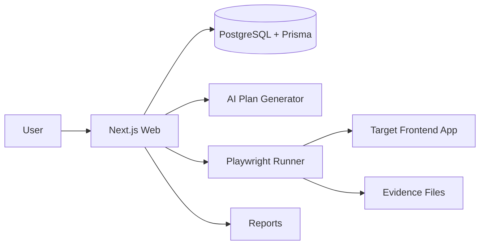
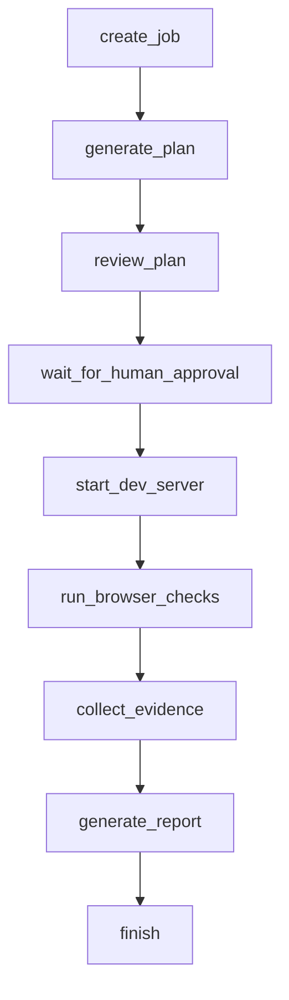

# SpecCheck Agent

SpecCheck Agent is an AI-generated-code acceptance assistant. It is not a code
generator. It helps teams answer the uncomfortable question after using AI coding
tools: "the page looks finished, but does it actually satisfy the original
requirement?"

This repository is implemented as a TypeScript monorepo. Phase 0-3 focus on the
core runnable loop: login, create project, enter requirement, generate a
structured acceptance plan, approve it, run deterministic Playwright checks, and
view JSON/Markdown reports.

## Architecture



## Agent Workflow



## Local Setup

Use `pnpm.cmd` on Windows if PowerShell blocks `pnpm.ps1`.

```powershell
copy .env.example .env
docker compose up -d
pnpm.cmd install
pnpm.cmd db:generate
pnpm.cmd db:push
pnpm.cmd dev
```

Web app: `http://localhost:3000`

## Run The Demo

1. Start Postgres and prepare the database:

```powershell
docker compose up -d
pnpm.cmd db:generate
pnpm.cmd db:push
```

2. Start the web app:

```powershell
pnpm.cmd --filter @speccheck/web dev
```

3. Register a local account at `http://localhost:3000/register`.

4. Create a project with:

- Name: `Demo Login App`
- Project path: the repository root, for example `C:\Users\33883\Desktop\SpecCheck Agent`
- Start command: `pnpm --filter demo-login-app dev`
- Default URL: `http://localhost:5173/login`

5. Create a new acceptance job and paste `examples/requirements/login.md`.

6. Review the generated JSON plan, approve it, and open the job report. The
   demo is intentionally incomplete, so the report should pass email/password
   inputs and login button existence while failing empty-password validation,
   loading state, or `/home` navigation.

## API Surface In Phase 0-3

- Auth: `POST /api/auth/register`, `POST /api/auth/login`, `POST /api/auth/logout`, `GET /api/auth/me`.
- Projects: `GET /api/projects`, `POST /api/projects`, `GET/PATCH/DELETE /api/projects/:id`.
- Jobs: `POST /api/projects/:id/jobs`, `GET /api/jobs`, `GET /api/jobs/:id`,
  `POST /api/jobs/:id/approve-plan`, `POST /api/jobs/:id/cancel`,
  `GET /api/jobs/:id/events`, `GET /api/jobs/:id/report`, `GET /api/jobs/:id/evidence`.
- Reports: `GET /api/reports/:id`, `GET /api/reports/:id/download/markdown`,
  `GET /api/reports/:id/download/json`.

## Phase 0-3 Scope

- Monorepo, TypeScript, ESLint, Prettier, Docker Compose.
- Prisma models for users, projects, jobs, plans, results, evidence, reports, logs.
- Local credential auth with hashed passwords.
- Project CRUD.
- AI or deterministic mock acceptance-plan generation with Zod validation.
- Human approval screen.
- Playwright acceptance runner for `element_exists`, `text_exists`, and `interaction`.
- Markdown and JSON reports with screenshot evidence.

The current execution path is synchronous inside the approval request so the
vertical slice is easy to run locally. Phase 4 moves long-running execution into
BullMQ and LangGraphJS while preserving the same schemas and persisted logs.

## Checks

```powershell
pnpm.cmd typecheck
pnpm.cmd test
```

The implemented unit coverage includes Zod schema validation, deterministic
requirement planning, report generation, RAG chunking, and safe command
validation.

## Safety Boundaries

- `startCommand` is validated against an allowlist.
- Dangerous commands such as `rm`, `del`, `format`, `shutdown`, and shell chaining are rejected.
- Browser execution is deterministic; LLMs generate plans but do not freely control the browser.
- API keys stay in environment variables and are not stored in the database.
- Dev server processes use timeouts and are killed after execution.

## Demo App

The demo login app intentionally misses several requirements. Once implemented,
run it through SpecCheck with `examples/requirements/login.md` to produce a
report that passes the basic fields and fails the missing empty-password,
loading-state, or navigation behavior.

## Later Phases

Phase 4-9 will add LangGraph stateful workflow, RAG with pgvector, MCP server,
advanced dashboard screens, Docker images, GitHub Actions, and deployment docs.
